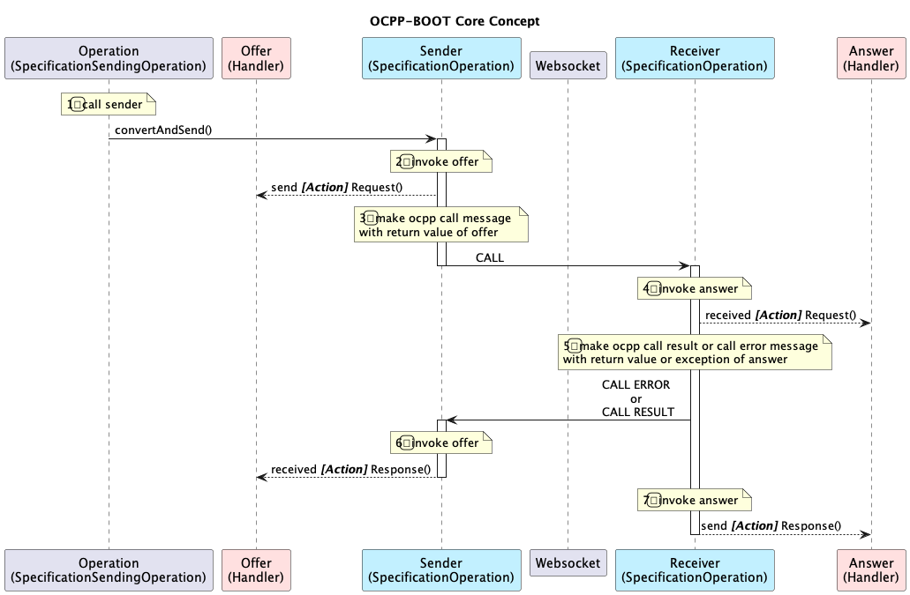

# ocpp-boot 
OCPP implementation based on spring-boot

* OCPP 1.6j
* OCPP 2.0.1
* OCPP 2.1

[ocpp-boot-server](https://github.com/u2ware/ocpp-boot-server) 

[ocpp-boot-client](https://github.com/u2ware/ocpp-boot-client)


## Install 

```bash
./mvnw install
```


## Core Concept 

