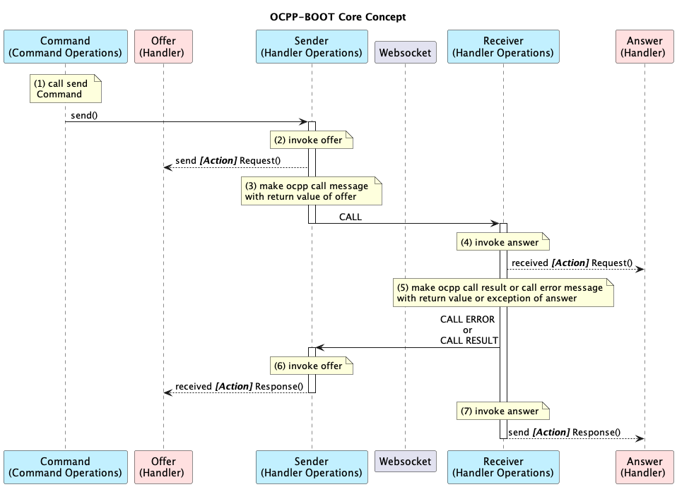

# ocpp-boot 
OCPP implementation based on spring-boot

* OCPP 1.6j
* OCPP 2.0.1
* OCPP 2.1

[ocpp-boot-server](https://github.com/u2ware/ocpp-boot-server) 

[ocpp-boot-client](https://github.com/u2ware/ocpp-boot-client)


## Install 

```bash
./mvnw install
```


## Core Concept 



* v1.6

|participant|object|
|------|:---|
|CommandOperations |[CentralSystemCommandOperations]()  or [ChargePointCommandOperations]() |
|Offer | [CentralSystemHandler]() or [ChargePointHandler]() |
|Sender |[CentralSystem]() or [ChargePoint]() |
|Receiver |[CentralSystem]() or [ChargePoint]() |
|Answer | [CentralSystemHandler]() or [ChargePointHandler]() |


* v2.0.1

|participant|object|
|------|:---|
|CommandOperations |[CSMSCommandOperations]()  or [ChargingStationCommandOperations]() |
|Offer | [CSMSHandler]() or [ChargingStationHandler]() |
|Sender |[CSMS]() or [ChargingStation]() |
|Receiver |[CSMS]() or [ChargingStation]() |
|Answer | [CSMSHandler]() or [ChargingStationHandler]() |


* v2.1

|participant|object|
|------|:---|
|CommandOperations |[CSMSCommandOperations]()  or [ChargingStationCommandOperations]() |
|Offer | [CSMSHandler]() or [ChargingStationHandler]() |
|Sender |[CSMS]() or [ChargingStation]() |
|Receiver |[CSMS]() or [ChargingStation]() |
|Answer | [CSMSHandler]() or [ChargingStationHandler]() |


